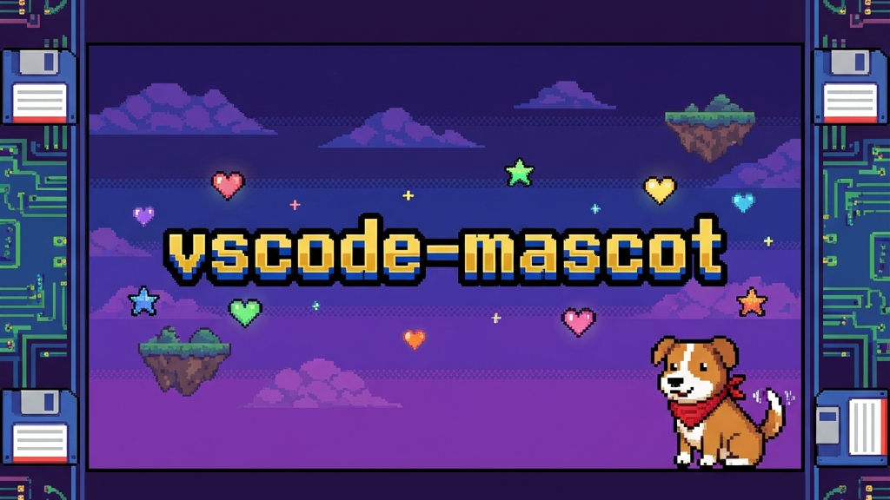

# VSCode Mascot

A cute mascot living in your VS Code title bar!

## Features

- **Cute Mascots**: Choose from a variety of pets including Akita, Totoro, Pikachu, and more!
- **Interactive**: Mascots walk around and occasionally jump or display messages.
- **Customizable**: Toggle the mascot on/off easily.

## Usage

1.  Open the Command Palette (`Ctrl+Shift+P` / `Cmd+Shift+P`).
2.  Type `Mascot: Toggle Pet` to enable or disable the mascot.
3.  Type `Mascot: Switch Pet` to choose a different character.

## Available Pets

- Akita (Dog)
- Totoro
- Fox
- Pikachu
- Dinosaur
- Clippy
- And many more!

## Installation

This extension modifies VS Code's core files to inject the mascot. 
**Note:** On first use, it may request permission to modify files. A restart of VS Code is required after enabling/disabling or switching pets.

## Uninstallation

To completely remove the mascot:
1.  Run the command `Mascot: Toggle Pet` to disable it (this cleans up the code injection).
2.  Uninstall the extension.

## Credits

This extension is a stripped-down version of [vscode-background-cover](https://github.com/AShujiao/vscode-background-cover), focusing solely on the "Little Pet" functionality.

> [!NOTE]
> このリポジトリはGA-Workspaceで作成されました
> 🌸 Powered by ZERO_GRAVITY
> https://github.com/Sunwood-ai-labs/ZERO_GRAVITY